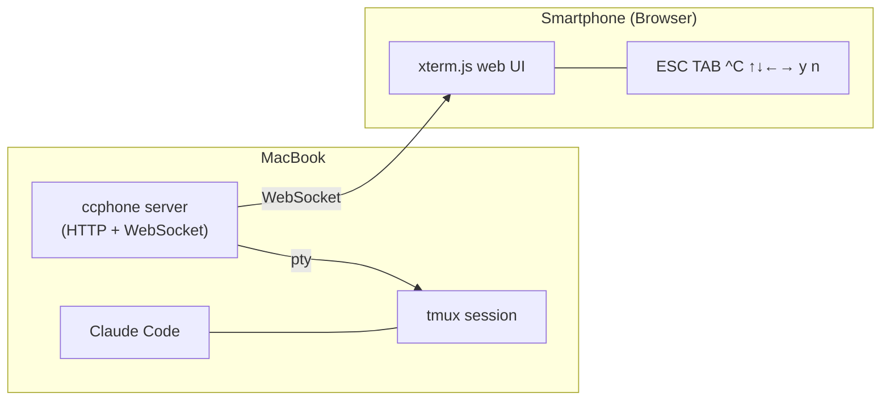

# ccphone

Access your [Claude Code](https://docs.anthropic.com/en/docs/claude-code) terminal session from your smartphone.

Run Claude Code on your PC inside tmux, then interact with it from your phone through a mobile-optimized web terminal. Designed for tethering setups where both devices share the same local network.

## How It Works



1. ccphone attaches to your tmux session via a pseudo-terminal
2. Terminal I/O is relayed over WebSocket to the browser
3. A QR code is printed so you can open the URL instantly on your phone

## Prerequisites

- **Node.js** >= 24
- **tmux** (`brew install tmux`)

## Setup

```sh
git clone https://github.com/ubugeeei/ccphone.git
cd ccphone
pnpm install
```

## Usage

### 1. Start Claude Code in tmux

```sh
tmux new -s claude
claude
```

### 2. Launch ccphone (in a separate terminal)

```sh
# Development mode
pnpm dev

# Or build first, then run
pnpm build
pnpm start
```

You can also specify a tmux session directly:

```sh
pnpm dev -- my-session
```

### 3. Connect from your smartphone

Scan the QR code displayed in your terminal, or open the URL manually in your browser.

The startup output looks like this:

```
ccphone v0.1.0

Attaching to session: claude

Server running on port 7777

Scan this QR code on your phone:

  ▄▄▄▄▄ ▄▄▄▄ ▄▄▄▄▄
  █ ▄▄▄ █ ▀▄▀ █ ▄▄▄ █
  ...

Waiting for connections... (Ctrl+C to quit)
```

If no tmux sessions exist, ccphone will offer to create one and launch Claude Code automatically.

## Mobile UI

The web terminal is optimized for smartphones:

- Full-screen terminal powered by [xterm.js](https://xtermjs.org/)
- **Quick-access toolbar** with ESC, TAB, Ctrl+C, `y`, and `n` buttons (common Claude Code interactions)
- Safe area support for notch / Dynamic Island
- Auto-resize on orientation change and virtual keyboard show/hide
- Automatic reconnection on disconnect

## Configuration

| Environment Variable | Default | Description |
|---|---|---|
| `CC_PHONE_PORT` | `7777` | Server port (auto-increments if in use) |

## Security

Each session generates a random 128-bit token embedded in the URL. Only clients with the token can access the terminal or establish a WebSocket connection. This is sufficient for a local tethering network between your own devices.

## Scripts

| Command | Description |
|---|---|
| `pnpm dev` | Run directly with Node's native type stripping |
| `pnpm build` | Bundle with tsdown |
| `pnpm start` | Run the built output |
| `pnpm test` | Run tests with vitest |
| `pnpm lint` | Lint with oxlint (type-aware) |
| `pnpm fmt` | Format with oxfmt |

## License

MIT
